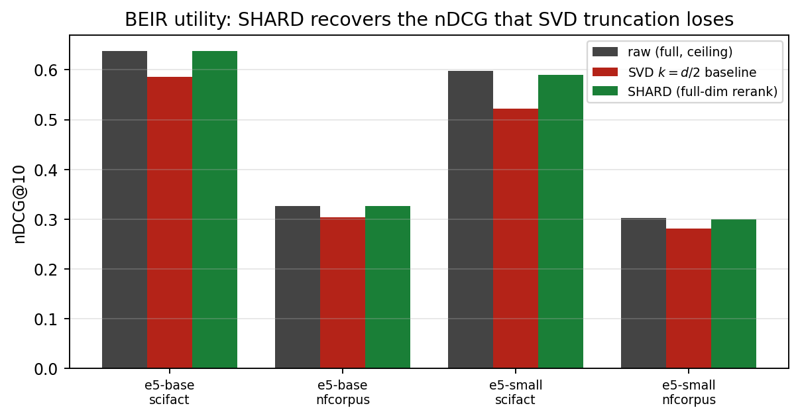
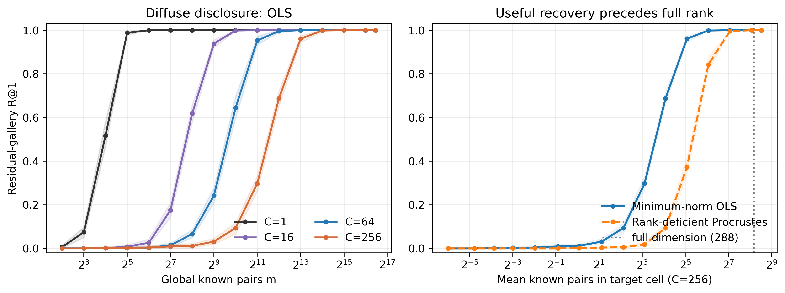
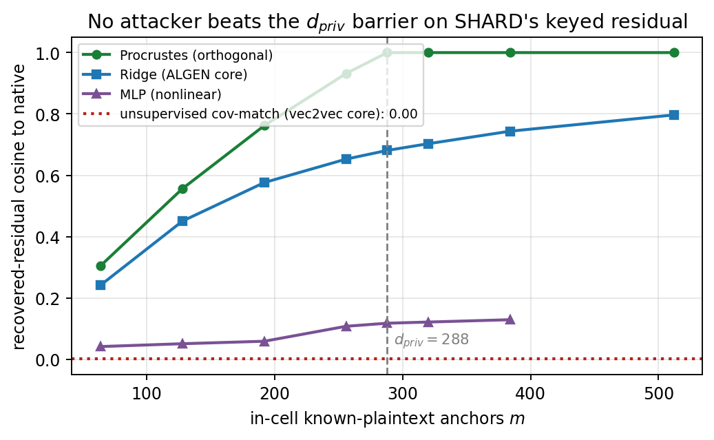
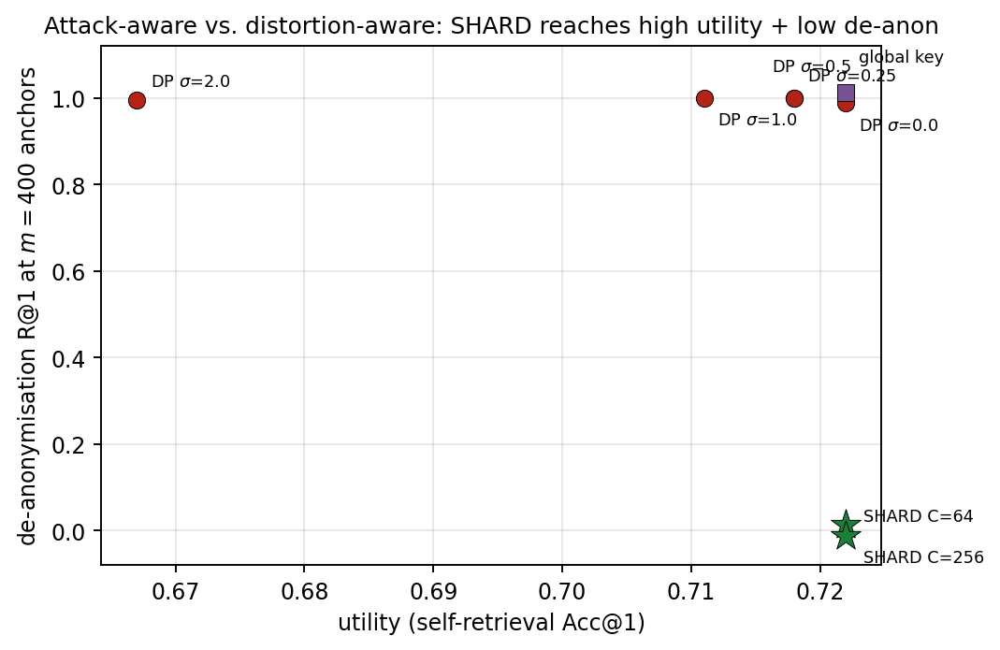

# SHARD: Cell-Keyed Residual Splitting for Alignment-Resistant Private Dense Retrieval

<!-- Replace OWNER/REPO with your GitHub path after pushing. -->
[](https://github.com/OWNER/REPO/actions/workflows/ci.yml)
[](LICENSE)


This repository contains the manuscript, code, and experimental results for
**SHARD**, a retrieval-preserving protective transform for dense text
embeddings that is designed against the *alignment* and *index-leakage*
attack surface, rather than against a distortion surrogate such as the
reconstruction error `σ_rec`.

> **One-line summary.** Instead of protecting a vector store with a single
> global geometry (data-dependent SVD + one secret rotation), SHARD splits
> each embedding into a short **public prefix** (for coarse stage-1
> retrieval) and a **private residual** that is *sharded* into `C` cells,
> each rotated by its own secret orthogonal key. Re-ranking happens under
> CKKS homomorphic encryption, where the per-cell keys cancel and preserve
> the **exact** inner product. A single parameter `C` interpolates between
> the global-linear baseline (`C=1`) and per-document micro-keys (`C=N`).

The paper positions the popular **SVD + global-rotation + PQ + CKKS** stack
as a carefully *measured baseline* (a foil), shows where it breaks, and then
introduces SHARD as an attack-aware replacement with **measured** advantages.

- 📄 Manuscript: [`paper/paper_en.pdf`](paper/paper_en.pdf) (37 pages, LaTeX source in [`paper/paper_en.tex`](paper/paper_en.tex))
- 🧪 All experiment outputs: [`results/`](results/)
- 🧩 Method + experiment code: [`shard/`](shard/) (contribution) and [`baseline/`](baseline/) (foil)

---

## Headline results

**1. Utility — SHARD reranks full-dimensionally, recovering the quality that SVD truncation loses on real IR.**



On BEIR, half-SVD truncation (the baseline) drops nDCG@10 by 2–8 points;
SHARD with a `d/4` public prefix matches the raw ceiling (e5-base/SciFact:
**0.638** vs. raw 0.637 vs. baseline 0.585) while exposing a public channel
half as wide.

**2. Alignment resistance — cell-local keys multiply the known-plaintext anchor cost by ≈ C.**



The median anchors to map the private residual back to the native frame
(diffuse leak) rise from **200** (single global key) to **25,600** (`C=64`)
and **102,400** (`C=256`), reproduced on a second encoder.

**3. The barrier is not an artefact of the Procrustes attacker.**



The learned-linear core of **ALGEN** (ridge), a non-linear MLP, and the
unsupervised core of **vec2vec** (covariance matching) all do *no better*
than orthogonal Procrustes — each still needs `≈ d_priv` in-cell pairs, and
the unsupervised attacker fails outright (sign ambiguity).

**4. Keying beats noising — vs. a distortion-aware DP defence at matched utility.**



At matched utility, a DP-noise residual is still trivially de-anonymised
(R@1 ≈ 1.0) because noise has no key to recover; SHARD reaches the same
utility with **de-anon R@1 = 0.00**.

| Property | Global-linear baseline | **SHARD** |
|---|---|---|
| Re-ranking | truncated half (loses nDCG) | **full-dimensional, exact** |
| Public index | full protected space (PQ ≈ 0.95 cos, 67% NN) | **short prefix** (NN-overlap 0.20–0.55) |
| Diffuse alignment cost | `~d/2` anchors (200) | **`~C·d_priv`** (up to 102,400) |
| Targeted (per-victim) cost | `~d/2` | `~d_priv` (320 / 576) |
| Neighbour-graph leak | global (1.00) | cell-local (0.50 → **0.00** micro-key) |
| Unlinkable / renewable | no | **yes** (residual channel) |
| Online cost | 1 encrypted query | 7–30 encrypted queries / search |

**Honest limitations (measured, not hidden).** Within a cell the keys
cancel, so same-cell similarities leak; and an *overlapping* plaintext
reference corpus still de-anonymises through the public prefix once its
single cheap global key is recovered. SHARD hardens the diffuse
alignment/inversion surface, **not** the coarse neighbour graph; it is an
attack-aware *geometric* defence, not a cryptographic guarantee.

---

## Repository layout

```
.
├── README.md                ← you are here
├── LICENSE                  ← MIT
├── requirements.txt         ← Python deps for the numpy/CPU experiments
├── CITATION.cff
├── paper/
│   ├── paper_en.tex         ← manuscript source
│   ├── paper_en.pdf         ← compiled manuscript (37 pp)
│   └── figs/                ← all figures
├── shard/                   ← THE CONTRIBUTION (numpy/scikit-learn only)
│   ├── paths.py             ← portable path resolution (SHARD_DATA / SHARD_RESULTS)
│   ├── shard_lib.py         ← the SHARD construction + utilities (paper §7)
│   ├── exp12_shard_utility.py … exp22_shard_learned_attack.py
│   └── make_fig_shard.py    ← regenerates the SHARD figures
├── baseline/                ← THE FOIL (global-linear stack + its analysis)
│   ├── paths.py
│   ├── exp_integral.py      ← 10^6-doc integral retrieval (paper §8.4)
│   ├── exp07…exp11.py       ← Procrustes/PQ leakage, σ_rec, significance, BEIR
│   ├── heavy_adaptive_inversion_rtx4090.py   ← Vec2Text stress test (GPU)
│   └── make_fig_significance.py, make_paper_figures.py
├── results/                 ← every experiment's JSON/CSV output
│   ├── exp12_outputs/ … exp22_outputs/   (SHARD)
│   ├── exp01_… exp11_outputs/             (baseline)
│   └── adaptive_inversion_outputs/
└── docs/
    ├── data_manifest.md     ← what the cached embeddings are
    ├── reproduce.md         ← regeneration notes
    └── environment.lock
```

The **17 GB of cached embeddings are intentionally not in the repo** (see
`.gitignore`). Point `SHARD_DATA` at a local copy or regenerate them
(`docs/reproduce.md`).

---

## The SHARD construction (paper §7)

Let `μ` be the corpus centroid and `V ∈ O(d)` the PCA rotation of the
centred embeddings. For a document `x`, write the centred, rotated coordinate

```
V(x − μ) = [ u | r ]
```

- **`u ∈ R^{d_pub}`** — a short *public* prefix (top variance directions),
  used for stage-1 approximate-nearest-neighbour retrieval;
- **`r ∈ R^{d_priv}`** — the *private* residual, `d_priv = d − d_pub`.

A coarse partition into `C` **cells** is defined by k-means on `u`. The data
owner draws one secret orthogonal key per cell, `H_c` (a product of
Householder reflections), and stores the pair

```
( u_i ,  z_i = H_{c(i)} r_i ).
```

**Online query.** The client computes `[u_q | r_q]`, runs stage-1 ANN
locally over the public prefix to get a `K_cands`-document short-list, then
for each active cell `c` sends `Enc(H_c r_q)` under CKKS. Because `H_c` is
orthogonal,

```
⟨ H_c r_q , z_i ⟩ = ⟨ r_q , r_i ⟩      (exact),
```

so the full similarity `S(q,i) = ⟨u_q,u_i⟩ + ⟨r_q,r_i⟩ = ⟨x_q−μ, x_i−μ⟩` is
reranked with **no truncation**. The cell count `C` is a single knob:
`C=1` is the global-linear baseline; `C=N` is per-document micro-keys
(no within-cell leak, unlinkable, alignment impossible) at the cost of one
residual query per candidate.

---

## Experiments

All SHARD experiments and the lightweight baseline analyses are **numpy /
scikit-learn only** (no GPU, no FHE library needed — the per-cell keys are
orthogonal, so the reranking score is exact and is computed directly). Only
the BEIR encoding (CPU PyTorch) and the optional Vec2Text stress test (GPU)
need the deep-learning stack.

### SHARD (the contribution)

| Script | What it measures | Key result | Output | Paper |
|---|---|---|---|---|
| `shard/shard_lib.py` | the construction | — | — | §7 |
| `exp12_shard_utility.py` | self-retrieval utility | SHARD ≈ raw, beats baseline | `results/exp12_outputs/` | §8.11 |
| `exp17_beir_shard.py` | BEIR utility | recovers raw nDCG@10 | `results/exp17_outputs/` | §8.11 |
| `exp18_shard_cost.py` | online cost | 7–30 enc. queries/search | `results/exp18_outputs/` | §8.12 |
| `exp13_shard_alignment.py` | diffuse anchor-complexity | 200 → 25.6k → 102.4k | `results/exp13_outputs/` | §8.13 |
| `exp19_shard_targeted.py` | targeted attacker | `m₅₀ ≈ d_priv`, ∀C | `results/exp19_outputs/` | §8.13 |
| `exp22_shard_learned_attack.py` | ridge / MLP / unsupervised | none beats `d_priv` | `results/exp22_outputs/` | §8.16 |
| `exp14_shard_leakage.py` | public-index leakage | prefix 0.20–0.55 vs 0.76 | `results/exp14_outputs/` | §8.14 |
| `exp20_shard_microkey.py` | micro-key variant | residual leak 0.00, AUC 0.50 | `results/exp20_outputs/` | §8.15 |
| `exp21_shard_vs_dp.py` | vs. DP-noise | DP de-anon 1.0, SHARD 0.0 | `results/exp21_outputs/` | §8.17 |
| `exp15_shard_reference.py` | overlap reference lookup | limitation (prefix de-anon) | `results/exp15_outputs/` | §8.18 |

### Baseline characterisation (the foil)

| Script | What it measures | Output | Paper |
|---|---|---|---|
| `baseline/exp_integral.py` | 10⁶-doc integral retrieval + CKKS | `results/exp5_outputs/` | §8.4 |
| `exp07_alignment_pq_leakage.py` | Procrustes recovers global `R`; public-PQ leakage | `results/exp7_outputs/` | §8.7 |
| `exp08_tradeoff_noise_sweep.py` | `σ_rec` is not a privacy metric | `results/exp8_outputs/` | §8.4 |
| `exp09_reference_corpus_attack.py` | overlap reference lookup (99.8% top-1) | `results/exp9_outputs/` | §8.8 |
| `exp10_denoiser_significance.py` | McNemar/bootstrap on the SVD "denoiser" | `results/exp10_outputs/` | §8.5 |
| `exp11_beir_denoiser.py` | the denoiser does **not** transfer to BEIR | `results/exp11_outputs/` | §8.6 |
| `heavy_adaptive_inversion_rtx4090.py` | aligned Vec2Text stress test (GPU) | `results/adaptive_inversion_outputs/` | §8.9 |

---

## Reproducing

### 1. Environment

```bash
python -m venv .venv && source .venv/bin/activate   # (Windows: .venv\Scripts\activate)
pip install -r requirements.txt
```

The geometry/privacy/utility experiments need only `numpy`, `scipy`,
`scikit-learn`, `matplotlib`. The BEIR experiments additionally need a CPU
build of `torch`, plus `transformers` and `datasets`. The optional Vec2Text
stress test needs a GPU (see `docs/reproduce.md`).

### 2. Data

The experiments read cached, L2-normalised embeddings of a 1M-paragraph
Russian-Wikipedia slice for five encoders (~17 GB; **not** in the repo).
Either point `SHARD_DATA` at a local copy:

```bash
export SHARD_DATA=/path/to/corpus_cache    # contains E_docs_<enc>_1000000.npy, E_queries_*
```

or regenerate them (encoder list and exact slicing in `docs/data_manifest.md`).

### 3. Run

```bash
cd shard
python exp13_shard_alignment.py            # alignment anchor-complexity (e5-small)
E13_ENC=e5-base E13_DPUB=192 python exp13_shard_alignment.py   # second encoder
python exp18_shard_cost.py                 # online cost
python exp19_shard_targeted.py             # targeted attacker
python exp22_shard_learned_attack.py       # learned/unsupervised attackers
python exp21_shard_vs_dp.py                # vs. DP-noise
python exp14_shard_leakage.py              # public-index leakage
python exp20_shard_microkey.py             # micro-key variant
python exp12_shard_utility.py              # self-retrieval utility (all encoders)
python exp17_beir_shard.py                 # BEIR utility (downloads SciFact/NFCorpus)
python make_fig_shard.py                   # regenerate figures -> ../paper/figs/
```

Every script is deterministic given its master-key / bootstrap seeds and
writes JSON to `results/`. Results in this repo were produced on a single
workstation (Intel Core i5-14400F, 32 GB RAM, Windows 11); the privacy/
utility geometry runs are CPU-only.

### 4. Build the paper

```bash
cd paper && pdflatex paper_en.tex && pdflatex paper_en.tex
```

---

## Tests

A self-contained test suite verifies SHARD's core invariants on small
synthetic arrays — **no embeddings required** — and runs in about a second
(it is also the CI smoke test):

```bash
python shard/test_shard.py     # or: make smoke
```

It checks the orthogonal-key cancellation `⟨H_c r_q, H_c r_i⟩ = ⟨r_q, r_i⟩`
(the exact-rerank identity), that the prefix+residual score equals the
centred inner product (no truncation), that orthogonal Procrustes needs
`≈ d_priv` anchors (the alignment barrier), that per-document micro-keys
decorrelate, and that the chunked top-k search matches brute force.
`make` also provides `figures`, `shard`, `baseline`, `paper`, and `clean`
targets (`make help`).

---

## Honest scope

This is a **scientific study of a protective transform**, not a deployable
privacy-preserving search product and not a cryptographic guarantee. SHARD's
demonstrated advantage is against **diffuse** known-plaintext alignment and
inversion, and against public-index leakage. It does **not** hide the
coarse neighbour graph (within-cell similarities leak; the micro-key limit
removes this at a bandwidth cost), and an overlapping plaintext reference
corpus still de-anonymises through the public prefix. Access patterns are
left to a PIR/ORAM composition, as in the baseline. The full generative
pipelines of the modern attacks (ALGEN's generator, ZSInvert's zero-shot LLM
decoder) need a GPU and remain future work; we evaluate their *alignment
cores* here.

---

## Citation

```bibtex
@misc{kurilenko_shard,
  title  = {SHARD: Cell-Keyed Residual Splitting for Alignment-Resistant
            Private Dense Retrieval},
  author = {Kurilenko, Sergey M.},
  note   = {Moscow Institute of Physics and Technology},
  year   = {2026}
}
```

## License

Code and documentation are released under the [MIT License](LICENSE). The
manuscript text and figures are © the author.
